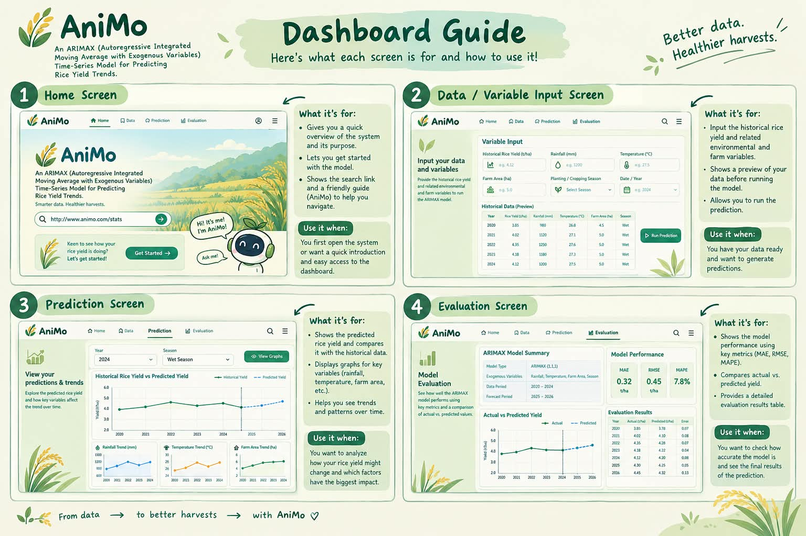

# AniMo

AniMo is a website for estimating rice yield trends using an ARIMAX time-series model.

## Features

- Input for rainfall, temperature, farm area, and planting/cropping season
- Historical rice yield data and trends
- ARIMAX-based rice yield estimation
- Graphs/charts to make trends easier to see
- Display of the estimated yield
- Accuracy results such as MAE, RMSE, and MAPE
- Simple dashboard/interface so it is user-friendly

## Mockup

We also have an AI-generated photo/mockup of the website to help you imagine the possible output or overall look of our system.

> **Note:** The mockup is only a visual guide, not the actual final website.
